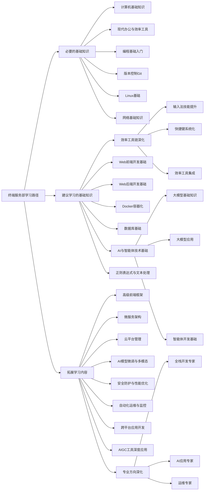

# 终端服务部培训路线图

> 自由、多元的树状学习路径 - 让每个成员都能以更高效的工作方式学习并完成任何任务

## 概述

终端服务部是一个核心支撑部门，负责构建和维护可靠的技术基础，同时推动知识管理和智能化工具开发与应用。
本文档采用树状学习路径结构，分为三个层次：**必要的基础知识**、**建议学习的基础知识**、**拓展学习内容**，允许成员自由选择和快速查阅。

## 学习路径分类

### 🟢 必要的基础知识

> **所有成员必须掌握的核心技能，是完成部门基础工作的前提**

- 与部门核心职责直接相关，日常工作中频繁使用
- 确保团队成员具备基本的工作能力

### 🟡 建议学习的基础知识

> **推荐学习的基础技能，能显著提升工作效率和质量**

- 支持更复杂任务的完成，提升工作产出质量
- 帮助成员成长为合格的技术人员

### 🔵 拓展学习内容

> **根据个人兴趣和职业发展方向选择的专业深化内容**

- 专业化、深度化的技能，支持个人职业发展和部门技术创新
- 培养专家级人才，推动部门技术创新

## 树状学习路径结构

## 快速查阅指南

### 按职责快速查找

- **基础设施运维**：Linux 基础、Docker 容器化、自动化运维
- **知识管理与创新**：编程基础、正则表达式与文本处理、AI 与智能体技术、AIGC 工具
- **平台运营与内容创作**：Web 前端开发、跨平台应用开发

### 按兴趣快速查找

- **前端开发**：Web 前端开发基础 → 高级前端框架 → 跨平台应用开发
- **后端开发**：Web 后端开发基础 → 微服务架构 → 云平台管理
- **AI 与智能体**：AI 与智能体技术基础 → AI 模型微调 → 智能体编排
- **运维与 DevOps**：Linux 基础 → Docker 容器化 → 自动化运维

## 🟢 基础知识

### 1. 计算机基础知识

#### 计算机入门概念

- 什么是计算机
- 计算机的基本组成（硬件/软件）
- 操作系统简介（Windows/Linux/macOS）
- 文件管理基础

#### 网络基础知识

- 互联网是什么
- 浏览器使用
- 网站和网页基本概念
- 简单网络安全意识

#### 办公软件基础

- 文档编辑（Word/在线文档）
- 电子表格（Excel/在线表格）
- 演示文稿（PowerPoint）

### 2. 现代办公与效率工具

#### 高效办公环境搭建

- 系统设置与个性化
- 常用软件安装与管理
- 快捷键使用

#### 效率工具链

- 文本编辑器（ [VS Code](.\VSCode\VS_Code高效使用指南.md) ）
- 笔记软件（Notion/语雀）

### 3. 编程基础入门

#### 编程思维培养

- 什么是编程
- 算法初步概念
- 逻辑思维训练

#### Python 基础语法

- 变量与数据类型
- 条件语句与循环
- 函数定义与使用
- 简单数据结构（列表、字典）

### 4. 版本控制 Git

- Git 基础操作
- 分支管理
- 远程仓库使用

### 5. Linux 基础

- 常用命令
- 文件权限管理
- 进程管理

## 🟡 建议学习

### 1. Web 前端开发基础

#### HTML/CSS 基础

- 网页结构（HTML）
- 样式设计（CSS）
- 响应式布局概念

#### JavaScript 入门

- JS 基础语法
- DOM 操作
- 事件处理

#### 前端框架初探

- Vue.js 或 React 入门
- 组件化思想
- 简单前端项目

### 2. Web 后端开发基础

#### 服务器与数据库基础

- 什么是服务器
- 数据库概念（MySQL/MongoDB）
- SQL 基础语法

#### 后端语言选择（Node.js/Python）

- RESTful API 概念
- 路由与中间件
- 数据库连接与操作

### 3. Docker 容器化

- 容器概念
- Docker 基础使用
- 镜像与容器管理

### 4. AI 与智能体技术基础

#### 大模型基础知识

- 什么是大语言模型
- AI 应用案例
- 提示词工程

#### 智能体开发基础

- 智能体概念与架构
- n8n 工作流编排基础
- MCP 协议与 A2A 通信概念

### 5. 效率工具链深化

#### 输入法技能提升

- 全拼输入法基础与优化
- 双拼输入法精通（重点推荐）
- 五笔输入法专业应用
- 输入法配置与个性化
- 打字速度与准确率训练

#### 快捷键系统化

- 系统级快捷键（Windows/macOS/Linux）
- 开发工具快捷键（VS Code/IntelliJ）
- 办公软件快捷键（Office/在线文档）
- 自定义快捷键方案

#### 效率工具集成

- 快速启动工具（Quicker/Wox/Alfred）
- 剪贴板管理（Ditto/Paste）
- 窗口管理工具（PowerToys/Rectangle）

### 6. 正则表达式与文本处理

#### 正则表达式基础

- 什么是正则表达式及其应用场景
- 基本语法：字符类、元字符、量词、分组
- 常用正则表达式模式示例

#### 编程语言中的正则表达式

- Python 中的 re 模块使用
- JavaScript 中的正则表达式方法
- 在文本编辑器中的搜索替换应用

#### 实际应用场景

- 数据验证（邮箱、电话、URL 等）
- 日志分析与文本提取
- 批量文件重命名与内容替换
- 命令行工具中的正则使用（grep、sed、awk）

## 🔵 拓展学习

### 1. 专业方向深化

#### 全栈开发专家

- 微服务架构
- 性能优化
- 安全防护

#### AI 应用专家

- 模型微调
- 多模态应用
- 智能体编排

#### 运维专家

- 云平台管理
- 监控与告警
- 自动化运维

### 2. 高级前端框架

- React/Vue 高级特性
- 状态管理（Redux/Vuex）
- 性能优化与调试
- 前端工程化

### 3. 微服务架构

- 服务拆分与设计
- API 网关
- 服务发现与配置中心
- 分布式事务

### 4. 云平台管理

- AWS/Azure/阿里云基础
- 云原生技术栈
- 容器编排（Kubernetes）
- 云安全与合规

### 5. AI 模型微调与多模态应用

- 大模型微调技术
- 多模态模型应用
- 智能体高级编排
- AI 应用部署与优化

### 6. 安全防护与性能优化

- Web 安全防护
- 系统安全加固
- 性能监控与调优
- 高可用架构设计

### 7. 自动化运维与监控

- 自动化部署流水线
- 监控系统搭建（Prometheus/Grafana）
- 日志收集与分析
- 故障自愈系统

### 8. 跨平台应用开发

- UniApp/Flutter/React Native
- iOS 原生开发（Swift）
- 安卓原生开发（Kotlin/Java）
- 桌面应用开发（Electron/Tauri）

### 9. AIGC 工具深度应用

- Stable Diffusion/ComfyUI 高级应用
- AI 视频生成与编辑
- 3D 模型生成
- AI 辅助设计工作流

## 学习方法建议

### 1. 理论与实践结合

- 每学一个知识点都要动手实践
- 通过项目整合所学内容

### 2. 循序渐进

- 从必要基础开始，逐步深入
- 扎实掌握基础后再进入下一阶段

### 3. 团队协作

- 参与开源项目
- 代码审查与分享
- 技术交流会议

### 4. 个性化学习路径

- 根据个人兴趣选择拓展方向
- 结合部门需求调整学习重点
- 定期评估学习进度和效果

## 评估与认证

### 1. 阶段性考核

- 每完成一个阶段进行自我评估
- 项目作品展示

### 2. 技能认证

- 内部技能等级评定
- 外部认证考试推荐

---

**相关文档**：

- [部门介绍](部门介绍.md)
- [学习路径分类说明](学习路径分类说明.md)

_最后更新：2025 年 12 月 17 日_
_维护者：@publieople 终端服务部_
